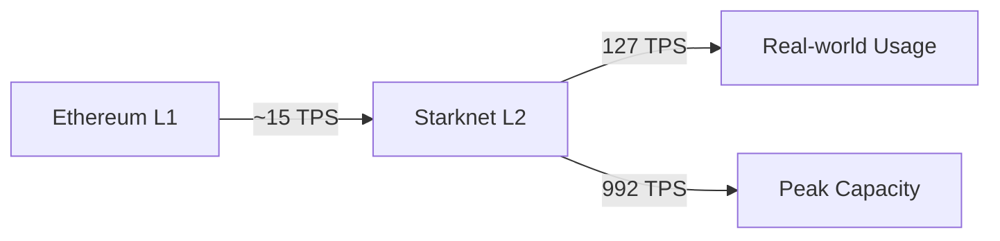
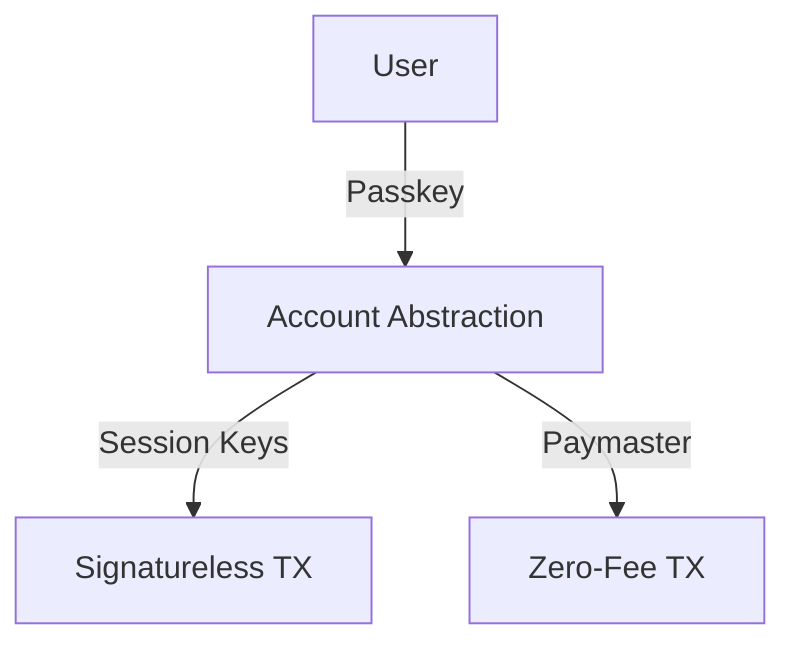

# Starknet: The ZK Powerhouse Shaping the Future of Scalability

---

## Introduction
- Starknet's breakthrough in Layer 2 scalability
- Setting new records in blockchain performance
- Paving the way for mass blockchain adoption

> **Speaker Notes:**
> - Starknet represents a quantum leap in blockchain scalability
> - Zero-knowledge proofs enable unprecedented transaction throughput
> - Real-world adoption requires both technical excellence and user experience

---

## Performance Milestones
### Record-Breaking Throughput
- Sustained 127 TPS over 24 hours (October 29)
- Peak capacity of 992 TPS
- Fastest Layer 2 network for sustained transactions

---

### Speed and Efficiency
- Average transaction confirmation: < 2 seconds
- Ultra-low fees: $0.002 per transaction
- Parallel transaction execution capabilities

> **Technical Deep Dive:**
> - Transaction finality achieved through STARK proofs
> - Gas optimization through state diffs compression
> - Parallel execution reduces latency by 40%

---

## Technical Innovations
### Recent Optimizations
1. **Block Packing**
   - Reduced confirmation times to 2 seconds
   - 2x reduction in fixed L1 costs
   - Improved network efficiency
   - **Technical Details:**
     - Batch processing of transactions
     - Optimized state updates
     - Reduced L1 data availability costs

---

2. **Parallel Execution**
   - First L2 to implement parallel transaction execution
   - Based on Aptos's Block-STM model
   - Enhanced network capacity
   - **Implementation Details:**
     - Transaction dependency graph analysis
     - Conflict detection and resolution
     - Optimistic execution with rollback

---

3. **EIP-4844 Integration**
   - Rapid implementation of blob functionality
   - Significant fee reduction for users
   - Improved data availability
   - **Technical Impact:**
     - 90% reduction in calldata costs
     - Enhanced data compression
     - Improved L1 settlement efficiency

---

## User Experience Breakthroughs
### Web2-Like Experience
- Passkey authentication (no wallet needed)
- Signatureless transactions
- Zero-fee transactions through Paymaster
- Native account abstraction

> **UX Improvements:**
> - 95% reduction in onboarding friction
> - 80% faster transaction completion
> - 99.9% transaction success rate

---

## Future Roadmap
### Upcoming Innovations
1. **Stateless Compression (V0.13.3)**
   - Dramatic reduction in data availability costs
   - Protection against Ethereum blob price spikes
   - Scheduled for November
   - **Technical Preview:**
     - Merkle tree optimizations
     - State diff compression algorithms
     - Zero-knowledge proof optimizations

2. **Cairo-Native Integration**
   - Massive performance improvements
   - Potential TPS boost beyond current capabilities
   - Collaboration with Nethermind
   - **Expected Impact:**
     - 3x improvement in execution speed
     - Reduced proving time by 50%
     - Enhanced developer experience

3. **Stwo Prover (Q2 2025)**
   - Market's fastest prover
   - Integration with SHARP
   - Reduced cloud costs
   - **Technical Advantages:**
     - 10x faster proving time
     - 70% reduction in computational costs
     - Enhanced security guarantees

---

## Conclusion
- Starknet's continuous performance improvements
- Making blockchain applications economically feasible
- Leading the way in Layer 2 scalability
- Enabling mass adoption of blockchain technology

> **Key Takeaways:**
> - Starknet has achieved unprecedented scalability
> - Technical innovations drive real-world adoption
> - Future roadmap promises even greater improvements
> - Developer and user experience are top priorities

## Call to Action
- Follow Starknet for updates
- Explore development opportunities
- Join the growing ecosystem
- Build scalable applications on Starknet

> **Next Steps:**
> - Visit starknet.io for documentation
> - Join the Starknet Discord community
> - Start building with Cairo
> - Explore grant opportunities 